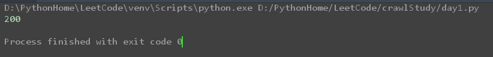
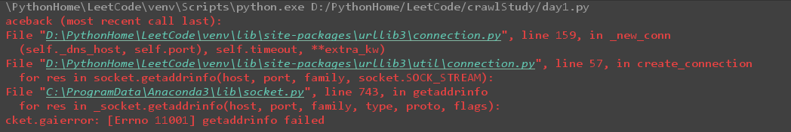
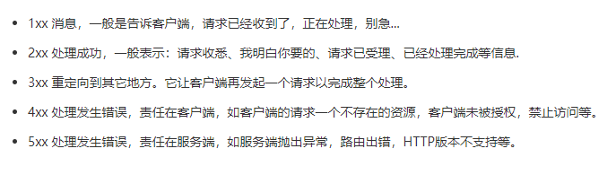
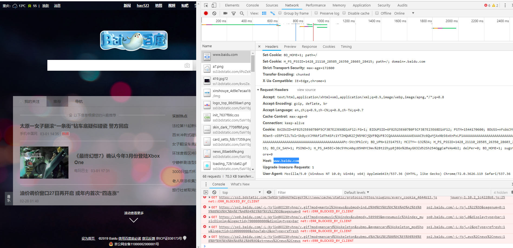

## Task1 学习get与post请求（截至日期3.1晚10点）  
### 1.学习get与post请求，尝试使用requests或者urllib用get方法向百度一下，你就知道发出一个请求，并将其返回结果输出  
 * get把参数包含在url中，post通过request body传递参数  
 * get在浏览器回退时是无害的，而post是会再次提交请求
 * get产生的url地址会被bookmark，而post的不可以
 * get请求会被浏览器主动cache，而post不会
 * get请求只可以进行url编码，而post支持多种编码
 * get请求会被完整保留在浏览器历史纪录中，而post中的参数不会被保留
 * get请求在url中传递的参数是有长度限制的，而post没有
 
### 2.如果是断开了网络，再发送申请，结果又是什么，了解返回的状态码。 
    # _*_ coding:utf-8 _*_
	import requests
	response = requests.get("http://www.baidu.com")
	print(response.status_code)
  
断开网络之后：  

  
状态码了解：  

 
### 3.了解什么是请求头，如何添加请求头。  
* User-Agent:产生请求的浏览器类型
* Accept：客户端可识别的内容型列表
* Host:请求的主机名，允许多个域名同处一个IP地址，即虚拟主机  

    # _*_ coding:utf-8 _*_
	import requests  
	headers = {
    'Accept':'text/html,application/xhtml+xml,application/xml;q=0.9,image/webp,image/apng,**;q=0.8',
    'User-Agent':'Mozilla/5.0 (Windows NT 10.0; Win64; x64) AppleWebKit/537.36 (KHTML, like Gecko) Chrome/72.0.3626.119 Safari/537.36',
    'Host':'www.baidu.com'
	}
	response = requests.get("http://www.baidu.com",headers = headers)
	print(response.status_code)
    