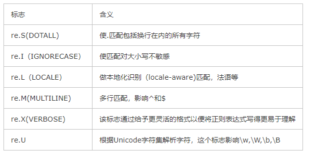

## 正则表达式  
参考网址：https://www.cnblogs.com/chamie/p/4905658.html   
主要使用的模块有：re  
其中常用的方法有如下：  
1.compile（）  
编译正则表达式模式，返回一个对象的模式  
###
	re.compile(pattern,flag = 0)
	pattern:编译时用的表达式字符串
	flags：编译标志位，可以用来修改表达式的匹配方式，如：是否区分大小写多行匹配等

常用的flags用如下几种：   
  
2.match（）  
决定re是否在字符串刚开始的位置匹配。（这个方法并不是完全匹配，当pattern结束时若string还有剩余字符，仍然视为成功。想要完全匹配，可以在表达式末尾加上边界匹配符$）  
3.findall（）遍历匹配最常使用的，返回的是一个列表  
`re.findall(pattern,string,flags = 0)`

出现的问题：  
1.使用[代码][1]出现匹配时间过长的问题。

[1]:https://github.com/bevishe/Datawhale/blob/master/crawl/code/day2.py

