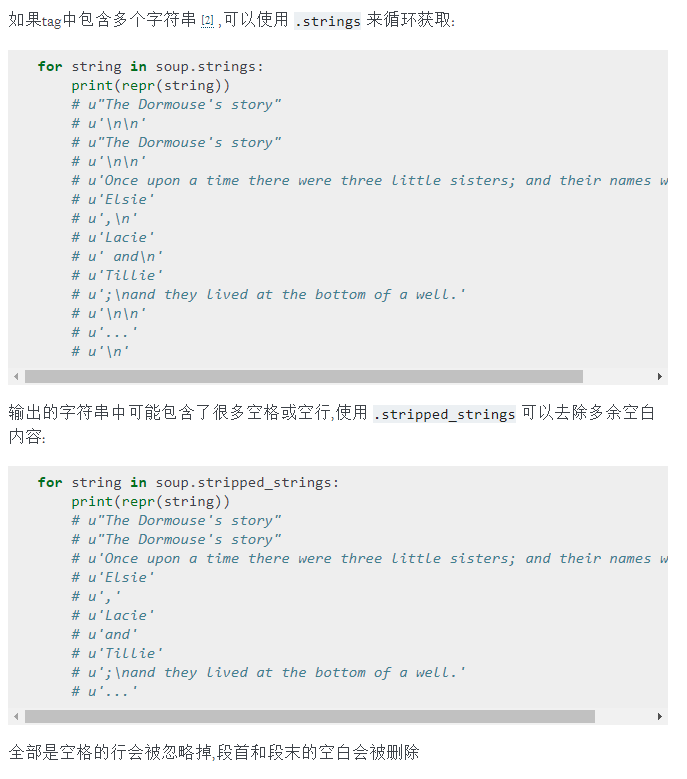

## 学习beautifulsoup  
参考网址：https://beautifulsoup.readthedocs.io/zh_CN/latest/  
其中可能使用到的解析器如下所示： 
  
BeautifulSoup将复杂的HTML文档转换成一个复杂的树行结构，每个节点都是python对象，所有对象可以归纳为四种：  
### 1. Tag对象与XML和HTML原生文档中的tag相同  
**属性**：(其中属性的操作都是符合字典相同，同时tag的属性可以被添加，删除，修改)  
name：获取tag自己的名字  
attrs：获取该tag的各种属性  
**多值属性**：  
最常见的多值的属性是class（一个tag可以有多个CSS的class），在beautifulsoup中多值属性的返回类型是list：  
###
	css_soup = BeautifulSoup('

')
	css_soup.p['class']
	# ["body", "strikeout"]

	css_soup = BeautifulSoup('

')
	css_soup.p['class']
	# ["body"]
如果某个属性在html中没有被定义为多值属性，那么beautifulsoup就会将这个属性作为字符串返回  例如id属性   
###
	id_soup = BeautifulSoup('

')
	id_soup.p['id']
	# 'my id'
将tag属性转换成字符串时，多值属性会合并为一个值  
###
	rel_soup = BeautifulSoup('
Back to the <a rel="index">homepage</a>
')
	rel_soup.a['rel']
	# ['index']
	rel_soup.a['rel'] = ['index', 'contents']
	print(rel_soup.p)
	# 
Back to the <a rel="index contents">homepage</a>

如果转化的文档是xml格式，那么tag中不包含多值属性  
###
	xml_soup = BeautifulSoup('

', 'xml')
	xml_soup.p['class']
	# u'body strikeout'
### 2.可以变量的字符串
字符串通常包含在tag内，beautifulsoup用NavigableString类来包装tag中的字符串。  
###
	tag.string
	# u'Extremely bold'
	type(tag.string)
	# <class 'bs4.element.NavigableString'>

tag中包含的字符串不可以被编辑，但是可以被另外一个字符串所替代，用replace_with()方法  
###
	tag.string.replace_with("No longer bold")
	tag
	# <blockquote>No longer bold</blockquote>
NavigableString对象支持遍历文档树和搜索文档树中定义的大部分属性，并非是全部，tag能够包含字符串或者其他tag，字符串不支持.contents .string属性或者find（）方法  
### 3.BeautifulSoup
BeautifulSoup对象表示的是一个文档的全部内容，大部分时间，可以把它当成一个tag对象，支持遍历文档树和搜索文档树的大部分方法，有一个name属性返回的是document作为内容的列表  
### 4.注释及特殊字符串(comment)
前面三种其实已经覆盖了html和xml中的所有内容，注释是一种特殊的对象

### 5.遍历文档树
eg：  
###
	html_doc = """
	<html><head><title>The Dormouse's story</title></head>
    <body>
	
<b>The Dormouse's story</b>

	
Once upon a time there were three little sisters; and their names were
	<a href="http://example.com/elsie" class="sister" id="link1">Elsie</a>,
	<a href="http://example.com/lacie" class="sister" id="link2">Lacie</a> and
	<a href="http://example.com/tillie" class="sister" id="link3">Tillie</a>;
	and they lived at the bottom of a well.

	
...

	"""

	from bs4 import BeautifulSoup
	soup = BeautifulSoup(html_doc, 'html.parser')
**如何使用这段例子来演示怎么样从文档中的一段内容找到另外一段内容**  
**子节点**：一个tag可能包含多个字符串或者其他tag，这些字符串和其他的tag就是这个tag的子节点，beautifulsoup中有很多操作和遍历子节点的属性，但是但是字符串子节点不支持  
通过属性来获取内容`soup.a`或者`soup.body.p`但是需要注意的是使用这种方法只能获取当前名字的第一个tag，如果想获得所有a标签的内容，就需要使用find_all()函数`soup.find_all('a')`  
**.contents和.children**：tag的.contents属性可以将tag的子节点以列表的方式输出：(注意输出的对象是该tag的直接子节点)

**.descendants**：  

**.string**:

**.strings 和 stripped_strings** :

**父节点**：

**兄弟节点**：
.next_sibling 和 .previous_sibling分别返回当前节点的下面一个兄弟节点和该tag的前面一个兄弟节点，返回的是一个节点  
.next_siblings 和 .previous_siblings返回的是该节点的所有后面的兄弟节点和所有前面的兄弟节点，可以对其进行迭代  
.next_element 和 .previous_element同上但是包括tag和字符串
.next_elements 和 .previous_elements 同上，返回的是所有的tag和字符串，同时可以迭代  
### 6.搜索文档树 
**find_all()函数**   
使用find_all()函数，可以向里面输入，字符串，正则表达式，或者列表，返回的是一个tag对象，搜索的是符合字符串，正则，列表中任意元素的html标签
###
	soup.find_all('b')
	# [<b>The Dormouse's story</b>]
	import re
	for tag in soup.find_all(re.compile("^b")):
    print(tag.name)
	# body
	# b
	soup.find_all(["a", "b"])
	# [<b>The Dormouse's story</b>,
	#  <a class="sister" href="http://example.com/elsie" id="link1">Elsie</a>,
	#  <a class="sister" href="http://example.com/lacie" id="link2">Lacie</a>,
如果没有适合的，可以自定义函数作为过滤器当做find_all的参数传入，当自定义的函数返回True表示当前元素匹配，返回False则表示不匹配  

find_all(name,attrs,recursive,string,**kwargs)   
name:查找到是名字为name的tag，可以是字符串，正则，列表，或者方法  

 
